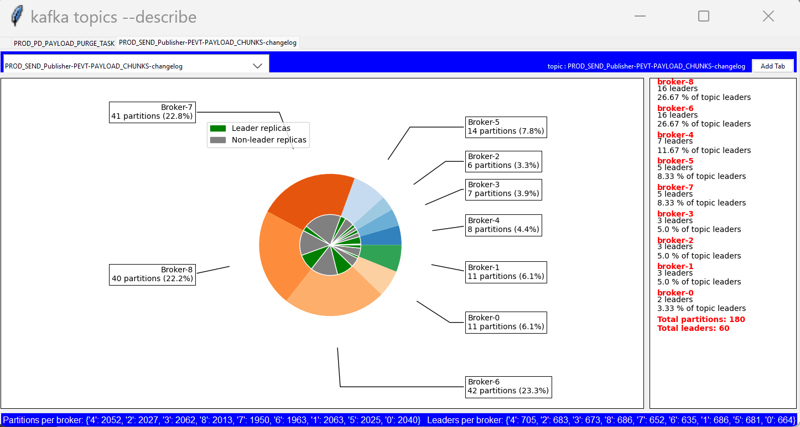

# Kafka Topics describe parser

This Python script is designed to parse an output file of `kafka-topics --describe` command and display some statistics about the topics in a Tkinter GUI.

## Installation

To install and run the script, you will need:

- Python 3.x
- The `kafka-python` package
- The `matplotlib` package
- The `tkinter` package (included with most Python installations)

You can install the required packages using `pip`, the Python package installer. For example:


## Usage

To use the script, simply run the `python topicsDescribe.py <filename>`  in a terminal or command prompt.

Once the script is running, it will display a Tkinter GUI that shows the didtribution of topics on the brokers of the cluster, as well as the total number of leaders and the number of partitions per broker.

You can use the combobox at the top of the GUI to select a topic and view more detailed information about the partitions for that topics.
You could create multiple tabs by selecting a topic and clicking the 'Add tab' button.


## Examples
```
python .\topicsDescribe.py "describeTopicProdEu"
```

Here is an example screenshot of the Kafka Topics describe parser GUI:



## Contact

If you have any questions or issues with the script, you can contact the author at ghassennasri8@gmail.com.

